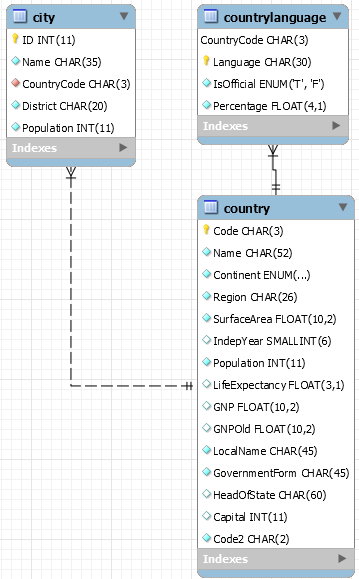

## 1- Récupérezet déployez la VM (CentOS 8 Minimal) , ou installer une CentOS 7 ou 8 a partir de l’ISO
## 2- Désactivation  du pare-feu
```bash
systemctl stop firewalld    #pour arrêter
systemctl status firewalld  #pour vérifier le status
```
## 3- Installation
### Installez le package mariadb-server
```bash
yum install mariadb-server
```
### [3A] Installez le package mariadb. Que contient ce package?
```bash
yum install mariadb
Package mariadb-3:10.3.17-1.module_el8.1.0+257+48736ea6.x86_64
```
### [3B] Qu’est ce que mariadb par rapport a mysql?
MariaDB est un fork de MySQL et offre des performances améliorées, par ailleurs MariaDB est entièrement sous licence GPL tandis que MySQL est sous double licence

## 4-Prise en main
### [4A] Quel est le fichier de configuration de configuration de mariadb?
**/etc/my.cnf** est el fichier principal de configuration
### [4B] Quel est son format?
Le fichier est en .cnf
### [4C] Quel est une de ses particularités?
Le fichier est écrit en forme normale conjonctive
### [4D] Quel est le répertoire de travail utilisé par le serveur pour stocker les bases de données?
**/var/lib/mysql/** est le répertoire de travail utilisé pour stocker les bases de données
### [4E] Cette emplacement vous semble-t-il pertinent? Justifiez votre réponse. 
Non car ce n'est pas un dossier créer pour faciliter les sauvegardes et on peut craindre uen perte de données en cas de problème
### [4F] Proposez une configuration plus conforme a celle d’un serveur de production.
On pourrait mettre les BDD dans un dossier tel que **/home/mariadb**, afin de regrouper les données en un endroit connu pour utiliser le partitionnement du disque afin de ne pas avoir à craindre une perte de données en cas de réinstallation du système
## 5- Démarrez le service mariadb.
```bash
systemctl start mariadb.service
systemctl status mariadb.service
```
### [5A] Sur quel port est a l’écoute le service mariadb par défaut? Quelle commande avez vous utilisée?
Le port est à l'écoute 3306
```bash
netstat -tlnp
tcp6       0      0 :::3306                 :::*                    LISTEN      4490/mysqld
```
### [5B] Sur quelle·s IP le service est-il a l’écoute?
Le service écoute sur toutes les adresses IP du port 3306
## 6- Connexion au service
### [6A] Quelle commande vous permet de joindre votre serveur mariadb?
```bash
mysql --protocol=TCP -u root
```
### [6B] Que permet de faire l’option --protocol?
Cela permet de préciser le protocole, dans cet exemple en TCP
### [6C] Quelle est l’autre méthode permettant de joindre un service mariadb? Quelle est sa limite?

```bash
mysql -u root
```
### [6D] Quel est le protocole utilisé par défaut par le client (cf la commande précédente ) pour joindre le service mariadb? Comment l’avez vous prouvé?
Le protocole utilisé par défaut est le TCP

## 7-SécurisationLe service mariadb/mysqld possède son propre système de gestion des comptes et des accès.
### [7A] Quel est le compte administrateur utilisé par mariadb?
Le compte administrateur utilisé par maraiadb est root
### [7B] Que ce passe-t-il si vous tentez de vous connecter sur le service mariadb et utilisant l’IP de la VM? (l’IP , pas l’adresse de bouclage!!)
```bash
mysql -u root -h 192.168.181.130
ERROR 1130 (HY000): Host '192.168.181.130' is not allowed to connect to this MariaDB server
```
### [7C] Que ce passe-t-il si vous  utilisez l’adresse 127.0.0.1.  Comment avez vous prouvé que vous êtes bien connecté en TCP/IP. Quelle commande avez vous utilisée pour le prouver? Quelle commande avez vous utilisé pour vous connecter? 
On peut se connecter avec l'adresse 127.0.0.1 grâce à **-h 127.0.0.1**  
On se connecte avec le protocole TCP/IP avec l'option **--protocol=TCP**
```bash
mysql -u root -h 127.0.0.1 --protocol=TCP
```
### [7D] Même question que précédemment, mais en utilisant localhost.
```bash
mysql -u root -h localhost --protocol=TCP
```
### [7E] Vous avez constaté que le serveur ne demande jamais de mot de passe. Sur quoi repose la sécurité des données? Quels sont les risques sur un serveur de production hébergeant par exemple un service Apache, Tomcat ou autre et le service mariadb?
La sécurité des données sur MariaDB gère ses propres utilisateurs et mots de passeet par défaut, lors de l'installation, le compte root n'a pas de mot de passe. Donc si quelqu'un accède au serveur il peut avoir accès à toutes les données...
### Le script mysql_secure_installation permet de sécuriser une installation de mariadb.
-Fixer un mdp pour le compte root
-Supprimer le compte anonyme
-Autorisez les accès distants pour le compte root
-Laissez la DB test sur le serveur
-Accepter l’application immédiate des changements (Flush des privilèges)
```bash
mysql_secure_installation
```
## 8- Création d’une DB via un script SQL.Le script SQL WORLDDB-FINAL-UTF8.sql permet de créer des tables  et de les alimenter dans une DB préalablement crée. 
### [8A] Créer la DB worlddb. Comment avez vous procédé?
create database worlddb;
### [8B] Affichez la liste des DB gérées par mariadb?
show databases;
### [8C] Injecter le script  WORLDDB-FINAL-UTF8.sql.  Quelle commande avez vous utilisée?
mysql -p worlddb < WorldDBWithFlagUTF8.sql
### [8D] Quelles sont les tables présentes? Quelle commande avez vous utilisé?
```SQL
show databases;
+--------------------+
| Database           |
+--------------------+
| information_schema |
| mysql              |
| performance_schema |
| worlddb            |
+--------------------+
```
### [8E] Combien de pays sont stockés dans la DB ?
```SQL
SELECT COUNT(Country_Id)
-> FROM country;
+-------------------+
| COUNT(Country_Id) |
+-------------------+
|               239 |
+-------------------+
```
### [8F] Donnez un schéma de la DB.

### [8G] Le fichier sakila-db.zip contient une DB de démonstration. Injectez cette DB dans le serveur. Comment avez vous procédé?
D'abord on importe le schema puis les données
```bash
mysql -u root -p < sakila-db/sakila-schema.sql
mysql -u root -p < sakila-db/sakila-data.sql
```
### [8H] Affiché les 5 premiers acteurs de la DB sakila (table actor)
```mysql
SELECT *
    -> FROM actor
    -> LIMIT 5;
+----------+------------+--------------+---------------------+
| actor_id | first_name | last_name    | last_update         |
+----------+------------+--------------+---------------------+
|        1 | PENELOPE   | GUINESS      | 2006-02-15 04:34:33 |
|        2 | NICK       | WAHLBERG     | 2006-02-15 04:34:33 |
|        3 | ED         | CHASE        | 2006-02-15 04:34:33 |
|        4 | JENNIFER   | DAVIS        | 2006-02-15 04:34:33 |
|        5 | JOHNNY     | LOLLOBRIGIDA | 2006-02-15 04:34:33 |
+----------+------------+--------------+---------------------+
```
### [8I] Quelles sont les DB gérées par le serveur?
```mysql
 show databases;
+--------------------+
| Database           |
+--------------------+
| information_schema |
| mysql              |
| performance_schema |
| sakila             |
| worlddb            |
+--------------------+
```
### [8J] Supprimez la DB sakila, et vérifiez la suppression. Quelles commandes avez vous utilisées?
```mysql
DROP DATABASE sakila;
Query OK, 23 rows affected (0.072 sec)
USE sakila;
ERROR 1049 (42000): Unknown database 'sakila'
```
## 9-Gestion des comptes et accès
### [9B] Qu’est ce qu’une injection SQL ?
C'est une faille de sécurité sur une base de données. Elle consiste a injecter dans une requête SQL en cours un bout de requête SQL pouvant en compromettre la sécurité de la base de données.
### [9C] Créez un compte « worldbuser ». Quelle commande SQL permet de créer un utilisateur ?
```mysql
CREATE USER 'worlduser'@localhost IDENTIFIED BY '123456';
```
### [9D] Donnez tous les droits a l’utilisateur « worldbuser » sur la DB « worlddb ». Quelle commande SQL permet de donner tous les droits sur une DB a un utilisateur  particulier ?
```mysql
GRANT ALL PRIVILEGES ON worlddb.* TO 'worlduser'@'localhost';
SHOW GRANTS FOR 'user'@'host';
```
### [9E] Quelle commande SQL permet de voir les permissions pour un utilisateur ? Quels sont les droits pour l’utilisateur « worlddbuser » ?
```mysql
SHOW GRANTS FOR 'worlduser'@'localhost';
+------------------------------------------------------------------------------------------------------------------+
| Grants for worlduser@localhost                                                                                   |
+------------------------------------------------------------------------------------------------------------------+
| GRANT USAGE ON *.* TO 'worlduser'@'localhost' IDENTIFIED BY PASSWORD '*6BB4837EB74329105EE4568DDA7DC67ED2CA2AD9' |
| GRANT ALL PRIVILEGES ON `worlddb`.* TO 'worlduser'@'localhost'                                                   |
+------------------------------------------------------------------------------------------------------------------+
```
### [9F] A quoi sert la commande SQL « FLUSH PRIVILEGES ; » ?
Cette commande sert à sauvegarder les changements sur les droits
### [9G] Comment prouver que les accès sont bien fonctionnels pour le compte « worlddbuser ».
On se connecte en tant que wolrduser et on vérifie les databases disponibles ainsi que les actions que l'ont peut effectuer
```mysql
mysql -u worlduser -p -h localhost --protocol=TCP
show databases;
+--------------------+
| Database           |
+--------------------+
| information_schema |
| worlddb            |
+--------------------+
use worlddb;
```
### [9H] Quel sont les tables accessibles avec le compte « worlddbuser ». Quelles commandes avez vous utilisées pour le prouver ?
```mysql
show tables;
+-------------------+
| Tables_in_worlddb |
+-------------------+
| city              |
| country           |
| countrylanguage   |
+-------------------+
```
### [9I] Quelle commande SQL permet de révoquer des droits ?
```SQL
REVOKE droits on database.* FROM 'user'@'host';
```
### [9J] A quoi sert le script mysql_setpermission ?
Le script permet de paramétrer les permissions pur un utilisateur
### [9K] A quoi sert le script mysqlaccess ?
Il sert à vérifier les droits d'un utilisateur sur une BDD

## 10 Sauvegarde et restauration
### [10A] Quels sont les principaux dangers liés à une mauvaise sécurité ?
Il y a la perte de données et le  vol de données
### [10B] Changer la population de tous les pays en la fixant a 10. Donnez la commande utilisée.
```SQL
UPDATE country
    -> SET Population = 10;
```    
### [10C] Faire une sauvegarde de la DB « worlddb » en nommant le script dumpworldb.sql. Vous fournirez ce script avec les autres documents qui vous sont demandés.
```SQL
mysqldump  -u root --single-transaction worlddb -p > dumpworldb.sql
```
### [10D] Quelle commande est utilisable pour faire une restauration d’une DB ?
```SQL
mysql -u root -p ma_nouvelle_base < sauvegarde.sql
```
### [10E] Qu’est ce qu’une sauvegarde logique ?
Les backups logiques consistent en un ensemble de commandes SQL qui permettent de restaurer les bases et les données.
### [10F] Quels sont les différents type de sauvegardes physiques ?
### [10G] Quelles autres commandes sont utilisées pour faire une sauvegarde ?
```bash
mysqlhotcopy db_name [/path/to/new_directory]
```
### [10H] Quel type de sauvegarde est proposé ?
Le type de sauvegarde proposée est la sauvegarde incrémentielle
### [10I] Quels avantages présent-il ?
La sauvegarde prend moins de temps à faire
### [10J] Quels sont les problèmes posés par ce type de sauvegarde ?
En cas de perte de données, il faudra restaurer tous les éléments sauvegardés un à un

## 11- Outils graphiques.
### [11A] Quel est l’intérêt d’une connexion a travers un tunnel SSH ?
Assurer la confidentialité, l’authentification, l’intégrité d’une communication et le contrôle des accès distants

## 12- Réplication comme solution de sauvegarde ?
### [12A] Quels sont les limites de la réplication ?
La réplication ne garantit pas une sauvegarde complète des données
### [12A] Quels sont les usages courant des serveurs de réplications?
La réplication permet la continuité d'un service
