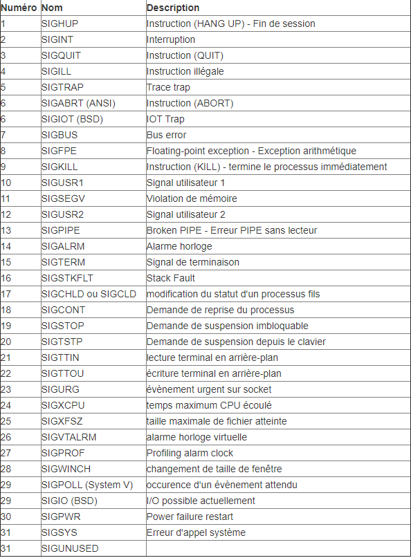

La valeur de l'UID est comprise entre les constantes UID_MIN et UID_MAX du fichier /etc/login.defs

SET - UID ==> chmod +s fichier

/sbin/init, /etc/init puis /bin/init

R pour running
S pour sleeping
T pour stopped
Z pour … zombie

# TD4 – Programmation C Système / Les processus
## 3- Commandes de base
### [3A] Quel est le rôle des commandes suivantes
- ps : affiche les informations des processus actif
- pstree : affiche les processus sous forme d'arbre
- kill : termine un processus
### [3B] Tapez la commande ps -aux. Quelle est son utilité ? A quoi correspondent les colonnes USER, PID, %CPU,%MEM, VSZ, RSS, TTY, STAT, START, TIME
Cette commande permet de visualiser les utilisateurs associés à chaque processus ainsi que des informations suplémentaires tel que :
- USER : l'utilisateur qui a lancé le processus
- PID : numéro du processus
- %CPU : affiche l'utilisation du processeur en pourcentage
- %MEM : affiche l'utilisation de la mémoire vive en pourcentage
- VSZ : Virtual Memorie Sizedonne l'utilisation des bibliotheques partagées et la memoire utilisé pour son fonctionnement
- RSS : Resident Set Size donne l'utilisation de la mémoire physique utilisée
- TTY : indique le numéro de port du terminal (le "?" indique que la commande n'est pas associée à un terminal)
- STAT : affiche l'état actuel du processus
- START : indique l'heure a laquelle le processus a commencé
- TIME : affiche le temps processeur utilisé par ce processus
### [3C] La commande top ou htop affiche une colonne PR et NI. A quoi correspond les deux colonnes ? Quelle est la difference entre PR et NI ?
- PR : priorité 
- NI :indique La valeur de politesse du processus
Une valeur négative signifie une priorité plus haute, à l'inverse d'une valeur positive. Un zéro signifie simplement que le lancement d'une tâche ne tiendra pas compte de la priorité.
### [3D] Quelle commande permet d’afficher la priorité d’un processus
La commande **nice** permet d'afficher la priorité d'un processus
## [3E] Quelle commande permet de changer la priorité d’un processus
La commande **renice** permet de modifier la priorité d'un processus 
```bash
renice <Priorité> {-p <PID> | -g <GID> | -u <User>}
```
### [3F] Quelle est la différence entre kill -3 et kill -9 ? A quoi correspondent les options -3 et -9 ? Donnez la liste des principaux signaux ( valeur numérique, nom, rôle)
- kill -3 : SIGQUIT, ?
- kill -9 : SIGKILL, termine le processus  

### [3G] Quelle est la particularité du signal SIGKILL ?
Termine à coup sûr le processus
### [3H] Quel est le rôle de la commande nohup ?
Permet de lancer un processus qui restera actif même après la déconnexion de l'utilisateur
### [3I] Quelles commandes vous permettent de passer un processus en arrière plan ? De le ramener en avant plan ? De le mettre en pause ?
- **nohup command &** permet de lancer le processus en arrière plan et **bg <PID>** permet de le passer en arrière plan
- **fg <PID>** permet de le ramener en avant plan
- **kill -STOP PID** permet de mettre en pause le processus

## 4- Gestion des processus
### [4A] Il existe deux approches pour passer le processus en « background » (tache de fond). Lesquelles ?
**nohup ./randomgenerator &** permet de lancer le processus en arrière plan et **bg <PID>** permet de le passer en arrière plan
### [4B] Votre processus est en tache de fond ? Tapez la commande « clear » ? Qu’observez vous ?
Le procesus est en fond et après **clear** le processus tourne encore
### [4C] Comment pouvez vous mettre le processus en pause ? Il existe deux approches, lequelles ?
On peut mettre en pause en faisant **CTRL + Z** ou **kill -STOP PID**
### [4D] Que devez vous faire pour le ramenez en « foreground » (avant plan?)
La commande **fg <PID>** permet de le ramener en avant plan
### [4E] Que devez vous faire pour arrêter le processus. Vous avez deux solutions, lesquelles ?
On peut arrêter le processus avec **KILL %1** ou **CTRL + C**
### [4F] Quelle est la différence entre un numéro de tache et un numéro de processus.
Le numéro de processus est global tant dis que le numéro de tâche est utilisé par le terminal uniquement
### [4G] Lancer le programme en tache de fond depuis un terminal ssh et déconnectez-vous du terminal. Le processus et il actif ? Comment avez vous vérifié?
Le processus est en sleep, on peut vérifier avec la commande **htop -p <PID>**
### [4H] Comment pouvez vous lancez un processus qui restera actif même si vous fermez la session ? Il existe au moins deux solutions, lesquelles ?
